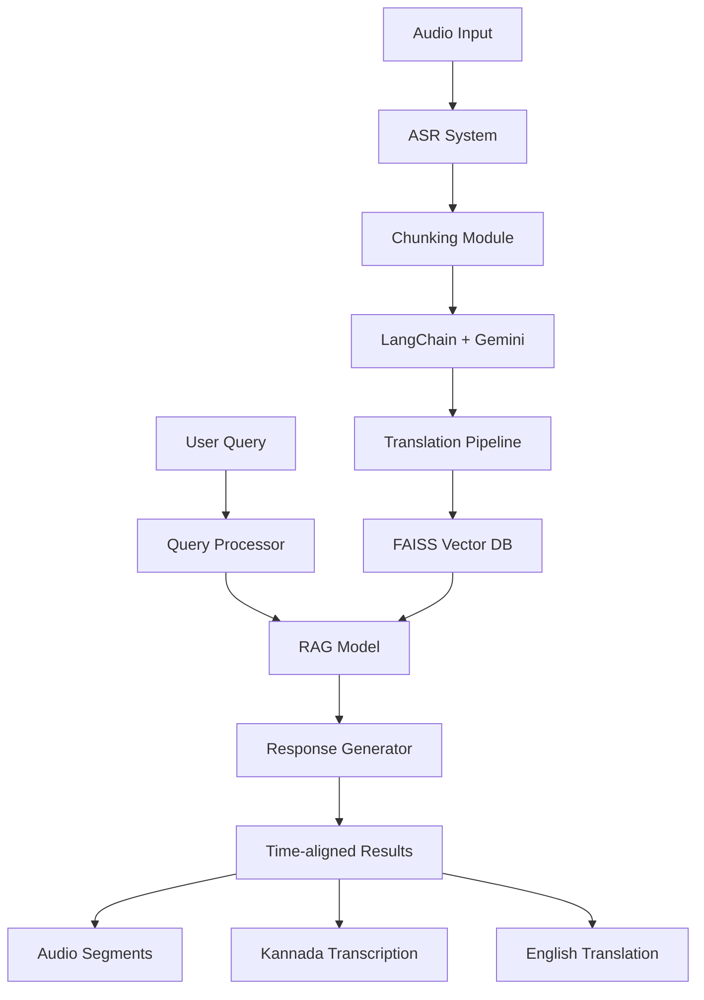
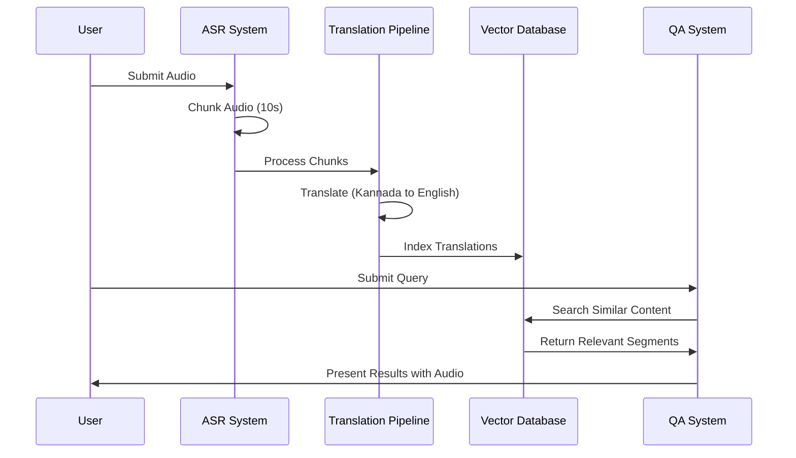

## 🏆 **ML FIesta IIIT Bangalore Winning Project**

# Sandalwood Knowledge Preservation System
### MLFIESTA Hackathon Project by Team Init.io

## 👥 Team Members
- Mayank Ravariya
- Asim Shah
- Vinayak Bhatia

*Sardar Patel Institute of Technology*

## 🎯 Project Overview
This project develops a cutting-edge system for preserving and accessing indigenous knowledge about sandalwood cultivation in Karnataka, India. It combines Automatic Speech Recognition (ASR) with an advanced question-answering system to make traditional knowledge accessible and searchable.

## 🌟 Key Features
- Kannada speech recognition optimized for colloquial language
- Real-time translation pipeline (Kannada to English)
- Semantic search capabilities using RAG architecture
- Time-aligned audio segment retrieval
- Interactive query interface supporting both text and voice input

## 🏗️ System Architecture



## 🔄 Workflow



## 🛠️ Technical Implementation

### Installation

```bash
# Clone the repository
git clone https://github.com/yourusername/sandalwood-knowledge-system.git

# Navigate to project directory
cd sandalwood-knowledge-system

# Create virtual environment
python -m venv venv

# Activate virtual environment
source venv/bin/activate  # Linux/Mac
venv\Scripts\activate     # Windows

# Install dependencies
pip install -r requirements.txt
```

### ASR Pipeline
1. Initial transcription using foundational models
2. Audio chunking into 10-second segments
3. Translation using LangChain-powered Gemini
4. Time-aligned parallel corpus creation

### QA System
1. RAG (Retrieval-Augmented Generation) architecture
2. FAISS vector database for semantic search
3. Sentence Transformer embeddings
4. Contextual relevance scoring

## 📊 Dataset
- **Source**: YouTube content on sandalwood cultivation
- **Language**: Colloquial Kannada
- **Characteristics**:
  - Informal speech patterns
  - Background noise
  - Various recording qualities
  - Local dialects

## 🎯 Achievements
- Successful handling of colloquial Kannada despite language barriers
- Innovative chunking method for precise time alignment
- Deep contextual analysis through RAG implementation
- Seamless integration of multiple cutting-edge technologies

## youtube video

Link : https://youtu.be/v5HhDsml4Aw

## output


## 📝 License
This project is licensed under the MIT License - see the [LICENSE](LICENSE) file for details.


